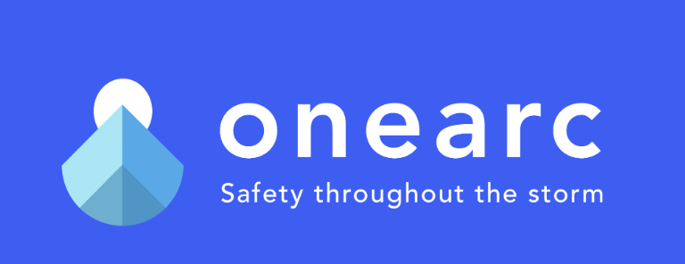
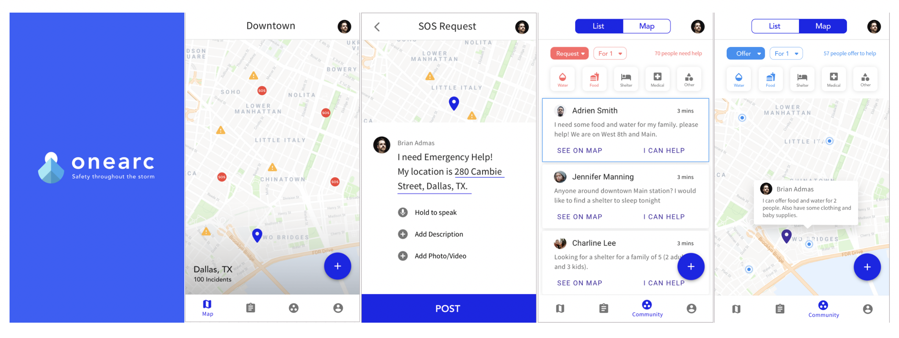

# ONEARC 

2018 AngelHack Global Demo Day Winner 
2018 AngelHack Hackcelerator Finalist 

### The Challenge
This project is a 4-month effort of an excited team that wants to change the way people get help during disasters. The team OneArc was formed after winning AngelHack Hackathon in Seattle, WA in July 2018. 

### Motivation 
With hurricane Harvey alone, 13 million people were affected and 135,000 homes were either damaged or destroyed. Most of disaster relief systems are swamped when disasters hit. We built OneArc, a holistic solution, to help people stay informed and assist one another during disasters. 

#### Team 
Ziwei Wang - UX/ UI Designer
Timothy Hyatt - Frontend Developer 
Joel Morancy - Frontend Developer 
Diep Truong - Backend Developer 
Dillon Easter - Backend Developer 
Sarah Hudson - Business Strategies 

### Our Project 

OneArc is a seamless mobile app that allows users to report incidents or hazards on the map. Users can also ask for resources or provide help to their local community. 

### Links 
- Global Demo Day Pitch: http://bit.ly/onearcpitch
- Backend Github Repo: http://bit.ly/onearcbackend

### Future Work 
- Create newsfeed tab 
- Integrate live video option 

### Note 
- This project has come to an end after Dec 2018. 
- The team OneArc has decided to move on with their invidivual projects and schooling. 